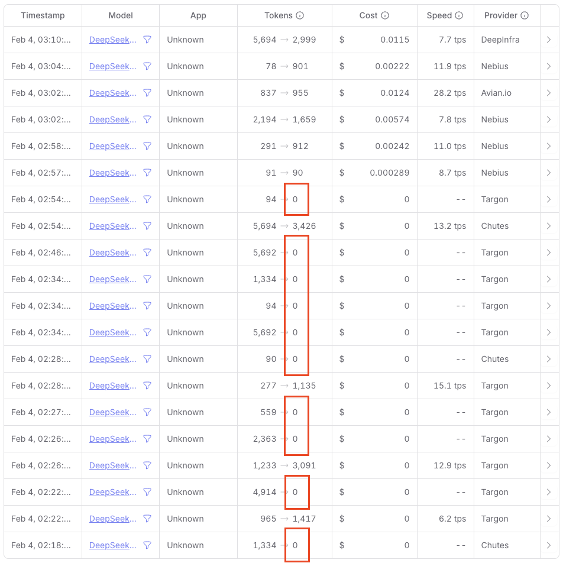

# loop

- Loop through an input folder of text files
- Prompt with the content of each input file
- Save the response in an output folder

### Preparation
```bash
pip install --upgrade openai
```

## ToC

### Setup API URL and Key
```bash
export PLATFORM_API_URL='https://openrouter.ai/api/v1'
export PLATFORM_API_KEY={KEY}
```

### Evolve a ToC
```
python evolve-toc.py \
  --model "deepseek/deepseek-v3.2-exp" \
  --prompt "prompt/evolve-toc.txt" \
  --base "param/toc.txt" \
  --input "sutra/N0006c" \
  --output "sutra/N0006c-toc-20251105-deepseek-v32"
```

### Split a ToC
```
python split-toc.py \
  --model "deepseek/deepseek-v3.2-exp" \
  --prompt "prompt/split-toc.txt" \
  --mapping "param/mapping.xlsx" \
  --number "1.2.1" \
  --remark "無常與緣起的總觀" \
  --base "param/toc-3.txt" \
  --input "sutra/N0006c-dds-20251111" \
  --output "sutra/N0006c-dds-20251111-1.2.1-split"
```

### Story from ToC
```
python story-toc.py \
  --model "deepseek/deepseek-v3.2-exp" \
  --prompt "prompt/story-toc.txt" \
  --input "sutra/N0006c-dds-20251111-1.2.1-split" \
  --output "sutra/N0006c-dds-20251111-1.2.1-story"
```

### Concat sections
```
pip install pandas openpyxl
```
```
python concat.py param/mapping.xlsx 2.2.2 sutra/N0006c-dds-20251111 N0006_ output/N0006c-dds-20251111-concat-2.2.2.txt
```

## Loop

### Setup API token
```bash
export DEEPSEEK_API_TOKEN='api-token'
```

### Run with DeepSeek V3
```bash
python deepseek-files.py \
  --system "You are a professional translator specializing in ancient Chinese Buddhist Sutras. \
    Your task is to translate classical Chinese Sutra texts into modern English while: \
    1. Preserving the original philosophical and religious meaning. \
    2. Using formal, sacred language appropriate for religious texts. \
    3. Maintaining technical terms (e.g., Sanskrit words like "Śūnyatā" or "Bodhisattva") untranslated. \
    4. Keep paragraph numbers in Arabic numerals, do not convert them to words (e.g., 'One', 'Two', 'I', 'II') \
    5. Ensure numbering, punctuation, and terminology match previous chapters (if applicable) \
    6. Output translated content in plain text and translated content only \
    Ensure the translation is faithful to the source text's intent and tone." \
  --prompt "Here is the text to translate:" \
  --model "deepseek-chat" \
  --temperature=0.3 \
  --input "sutra/grouped-chi" \
  --output "sutra/grouped-eng-ds-v3" \
  --timeout 600
```

### Run with DeepSeek R1
```bash
python deepseek-files.py \
  --system "You are a professional translator specializing in ancient Chinese Buddhist Sutras. \
    Your task is to translate classical Chinese Sutra texts into modern English while: \
    1. Preserving the original philosophical and religious meaning. \
    2. Using formal, sacred language appropriate for religious texts. \
    3. Maintaining technical terms (e.g., Sanskrit words like "Śūnyatā" or "Bodhisattva") untranslated. \
    4. Keep paragraph numbers in Arabic numerals, do not convert them to words (e.g., 'One', 'Two', 'I', 'II') \
    5. Ensure numbering, punctuation, and terminology match previous chapters (if applicable) \
    6. Output translated content in plain text and translated content only \
    Ensure the translation is faithful to the source text's intent and tone." \
  --prompt "Here is the text to translate:" \
  --model "deepseek-reasoner" \
  --temperature=0.3 \
  --input "sutra/grouped-chi" \
  --output "sutra/grouped-eng-ds-r1" \
  --timeout 600
```

- DeepSeek API [uptime](https://status.deepseek.com/uptime/)

### Run with Nvidia
```bash
python nvidia-files.py \
  --system "You are a professional translator specializing in ancient Chinese Buddhist Sutras. \
    Your task is to translate classical Chinese Sutra texts into modern English while: \
      1. Preserving the original philosophical and religious meaning. \
      2. Using formal, sacred language appropriate for religious texts. \
      3. Maintaining technical terms (e.g., Sanskrit words like "Śūnyatā" or "Bodhisattva") untranslated. \
      4. Keep paragraph numbers in Arabic numerals, do not convert them to words (e.g., 'One', 'Two', 'I', 'II') \
      5. Ensure numbering, punctuation, and terminology match previous chapters (if applicable) \
      6. Output translated content in plain text and translated content only \
    Ensure the translation is faithful to the source text's intent and tone." \
  --prompt "Here is the text to translate:" \
  --model "deepseek-ai/deepseek-r1" \
  --temperature=0.3 \
  --input "input" \
  --output "output" \
  --timeout 1800
```

### Run with OpenRouter
```bash
python openrouter-files.py \
  --prompt "Translate the following Chinese text into English:" \
  --model "deepseek/deepseek-r1"
```

Example (using OpenRouter `deepseek/deepseek-r1`)
```bash
python openrouter-files.py \
  --prompt "Translate the following Chinese Buddhism sutra into English and output in plain text, translated content only, no markdown, minimum formatting:" \
  --model "deepseek/deepseek-r1" \
  --input "sutra/grouped-chi" \
  --output "sutra/grouped-eng-or-r1" \
  --timeout 1800
```

Example (using OpenRouter `deepseek/deepseek-r1:free`)
```bash
python openrouter-files.py \
  --prompt "Translate the following Chinese Buddhism sutra into English and output in plain text, translated content only, no markdown, minimum formatting:" \
  --model "deepseek/deepseek-r1:free" \
  --input "sutra/grouped-chi" \
  --output "sutra/grouped-eng-or-r1-free" \
  --timeout 1800
```

Example (loop above prompt for 100 times)
```bash
chmod a+x ./openrouter-loop.sh
./openrouter-loop.sh 10 \
prompt/denoise.txt \
"qwen/qwen3-vl-235b-a22b-instruct" \
"sutra/N0006c" \
"sutra/N0006c-denoise"
```

Note about [free](https://openrouter.ai/deepseek/deepseek-r1:free) and [paid](https://openrouter.ai/deepseek/deepseek-r1) DeepSeek R1 models on OpenRouter:
<details>
  <summary>Free model providers return lots of empty response:</summary>
  
</details>

### Run with SiliconFlow
```bash
python siliconflow-files.py \
  --system "You are a professional translator specializing in ancient Chinese Buddhist Sutras. \
    Your task is to translate classical Chinese Sutra texts into modern English while: \
      1. Preserving the original philosophical and religious meaning. \
      2. Using formal, sacred language appropriate for religious texts. \
      3. Maintaining technical terms (e.g., Sanskrit words like "Śūnyatā" or "Bodhisattva") untranslated. \
      4. Keep paragraph numbers in Arabic numerals, do not convert them to words (e.g., 'One', 'Two', 'I', 'II') \
      5. Ensure numbering, punctuation, and terminology match previous chapters (if applicable) \
      6. Output translated content in plain text and translated content only \
    Ensure the translation is faithful to the source text's intent and tone." \
  --prompt "Here is the text to translate:" \
  --model "deepseek-ai/DeepSeek-R1" \
  --temperature=0.3 \
  --input "sutra/grouped-chi" \
  --output "sutra/grouped-eng-sf-r1" \
  --timeout 1800
```

&copy;2025 [SturaLLM](https://github.com/sutrallm/)
